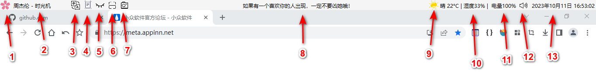
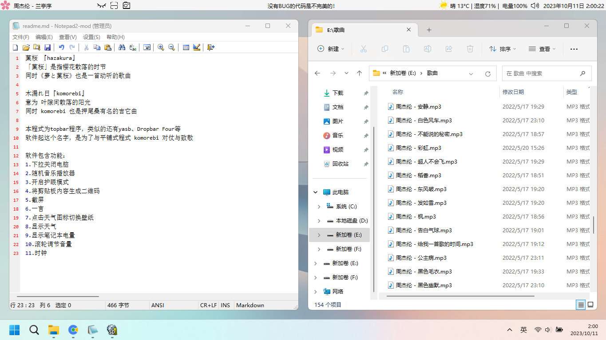

## 简介

�~�@ 『hazakura』

「�~�@」是指樱花散落的时节

同时《�簸热~�@》也是一首动听的歌曲

木漏れ日『komorebi』

意为 叶隙间散落的阳光

同时 komorebi 也是押尾桑有名的吉它曲

本程式为topbar程序，类似的还有yasb、Dropbar Four等

软件起这个名字，是为了与平铺式程式 komorebi 对仗与致敬

## 软件包含功能：

1. 鼠标左键，调用slidetoshutdown，下拉关机

2. 鼠标左键，随机播放mp3格式歌曲 | 鼠标右键，停止播放

3. 翻译：先将要翻译的内容复制到剪贴板，鼠标左键，弹出翻译结果并复制到剪贴板

4. OCR:  需要配合7 截屏工具使用，使用7 截图，点击√ 复制到剪贴板，点击4 OCR ，识别截图中的文字内容（支持中文英文混合）

5. 护眼 关灯

6. 复制文本到剪贴板，鼠标左键，生成二维码图片到桌面 | 鼠标右键，将二维码复制到剪贴板

7. 截屏

8. 一言 ，鼠标左键，改变内容

9. 表面上是天气图标，鼠标左键，随机切换壁纸（数据来自 喵切 cat-switch）

10. 天气

11. 电量

12. 鼠标左键，静音 | 鼠标放在喇叭图标上方，滑动鼠标滚轮，改变音量大小 

13. 时间 ， 鼠标左键，关闭程序（恢复占用空间）